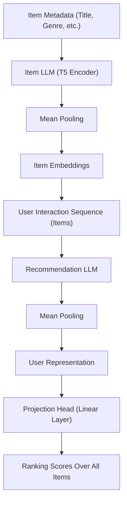

# LLM-Based Sequential Recommendation

Sequential recommendation aims to predict the next item a user will interact with based on historical interactions.

Traditional LLM-based recommenders rely on autoregressive decoding with beam search, which introduces significant inference latency and computational overhead.

This is an independent implementation inspired by recent research on efficient LLM-based recommendation systems.

This project implements a hierarchical LLM architecture that:

- Compresses verbose item metadata into dense embeddings using an Item LLM
- Models user interaction sequences efficiently using a Recommendation LLM
- Eliminates autoregressive beam search decoding via a projection-based ranking head
- Reformulates recommendation as a ranking task instead of a generative decoding task

The goal is to improve inference efficiency while maintaining strong recommendation performance.

---

## Architecture Variants

This repository includes two architecture variants:

### 1. Hierarchical LLM-Based Sequential Recommendation (Baseline)
- Item metadata encoded using a pre-trained Item LLM
- Sequence modeling via a Recommendation LLM
- Direct ranking using a projection head
- Reformulates recommendation as a ranking task instead of autoregressive generation

### 2. Retrieval-Augmented (RAG) Sequential Recommendation
- Retrieves top-K relevant items using embedding similarity
- Augments user sequence representation with retrieved contextual signals
- Enhances robustness by incorporating retrieved item-level knowledge
- Designed to improve contextual awareness beyond pure sequence modeling
---

## Dataset

- MovieLens-1M (ML-1M)
- Leave-one-out evaluation strategy:
  - Last item → Test
  - Second last item → Validation
  - Remaining items → Training

---

## Evaluation Metrics

- Recall@10
- Recall@20
- NDCG@10
- NDCG@20

---

## Architecture

The model follows a hierarchical LLM structure composed of three main components:

### 1. Item LLM
Encodes item metadata (e.g., title, genre) into compact context-aware embeddings using a pre-trained language model.  
Mean pooling is applied over token representations to obtain a fixed-length item embedding.

### 2. Recommendation LLM
Takes a sequence of item embeddings as input instead of raw text, significantly reducing input length and redundant computation.  
The final sequence representation is obtained using mean pooling over hidden states.

### 3. Projection Head
Replaces autoregressive beam search decoding with a single-layer projection head.  
The user representation is directly projected into the item embedding space to compute ranking scores over the entire item set.

This reformulates recommendation as a ranking problem rather than a generative decoding task, improving inference efficiency.

---

## Architecture Diagram

